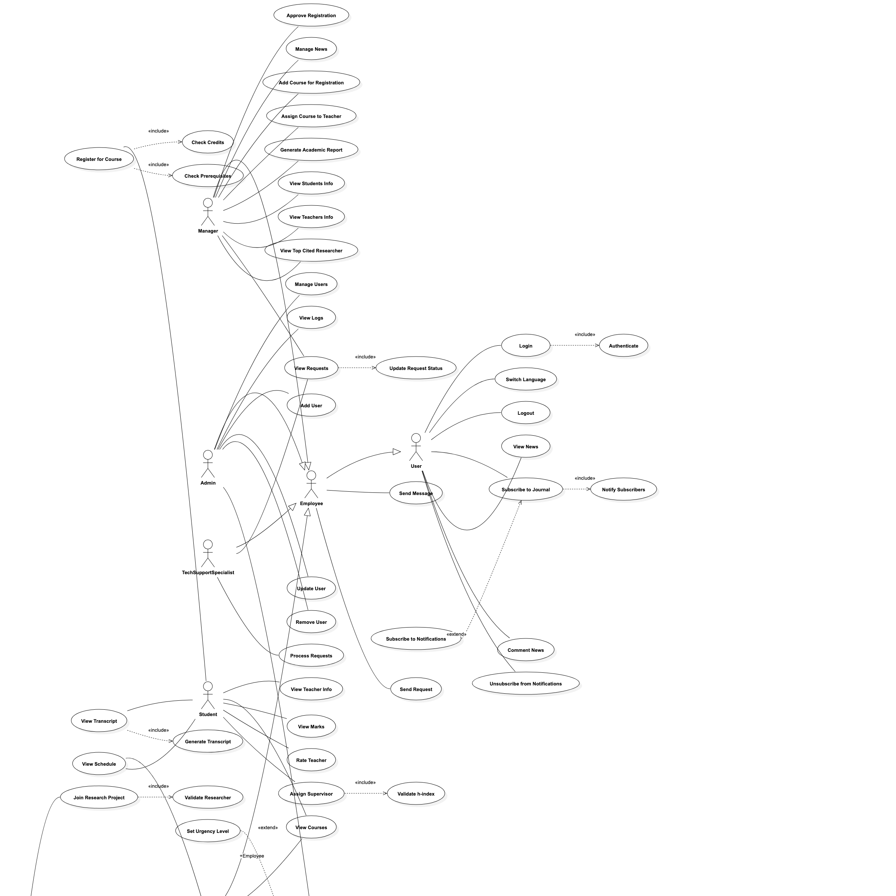
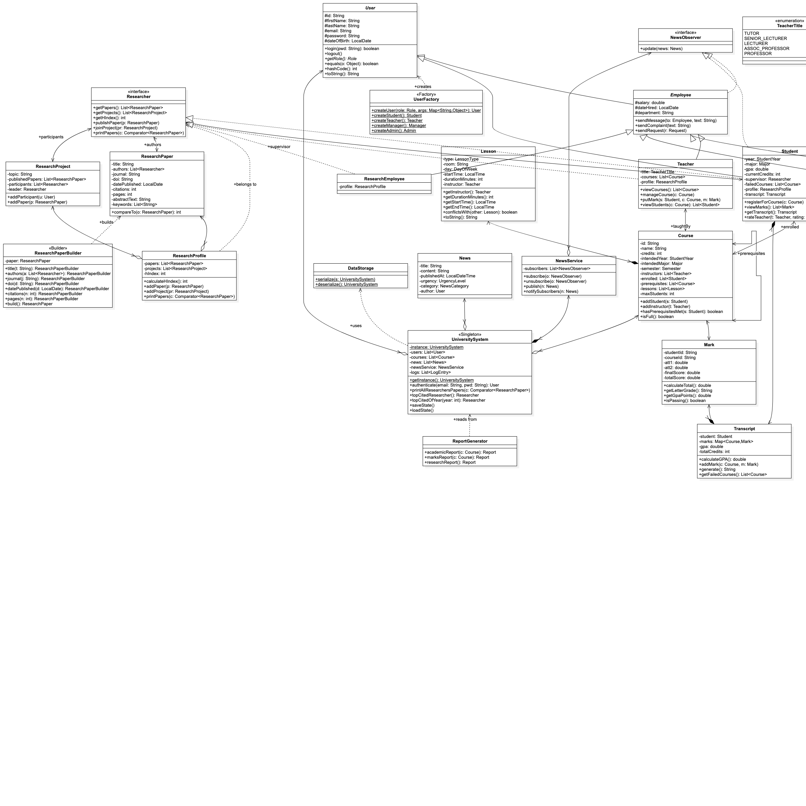
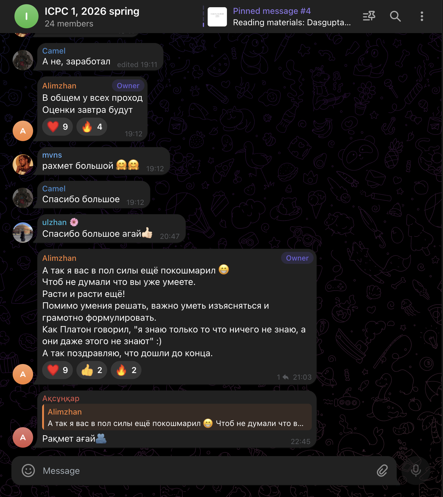

# KAZAKH-BRITISH TECHNICAL UNIVERSITY

School of Information Technology

**Project name:** KBTU University Intranet

**Discipline:** Object-Oriented Programming

&nbsp;

&nbsp;

&nbsp;

Team members:

**Ussibaliyev Yergali Ganiyevich**

Serikbayuly Serzhan *(team lead)*

Zhutanov Farkhat Zhasulanovich

\newpage

# The main goal of the project

Create a project university system **INTRANET**. The university management system is a form of distribution, coordination and implementation of management activities within the structure of an educational institution. The relationship between employees and students of the university should be facilitated and of high quality. To achieve this, our goal was to make a convenient console Java application that supports the simplest basic queries for students and university staff using the knowledge gained in object-oriented programming courses.

# Project description

1. Create an architecture using Use Case and UML Class Diagrams.
2. Working with IntelliJ IDEA.
3. Report, documentation, presentation.

# 1. Diagrams

We have created diagrams using the **StarUML** tool. The UML model is divided into two parts:

* Use-case diagram
* Class diagram

## Use-Case diagram



The system supports five primary actors:

* **Admin** — manages the user lifecycle (add / remove / update) and audits the log.
* **Manager** — opens courses for registration, assigns teachers, approves student registrations, generates reports.
* **Teacher** — views courses and students, records marks, publishes research, writes recommendation letters.
* **Student** — registers for courses, views the transcript and GPA, rates teachers, views attendance.
* **Research Employee** — publishes papers, joins research projects, computes h-index.

Each role is a subclass of `Employee` (which extends `User`) except `Student`, which extends `User` directly.

## Class diagram



The class diagram shows the complete hierarchy:

* `User` → `Employee` → `Teacher` / `Manager` / `Admin` / `ResearchEmployee`
* `User` → `Student`

The `Researcher` interface is a *mix-in* that lets `Teacher`, `Student`, and `ResearchEmployee` participate in research activities through a `ResearchProfile` composition rather than multiple inheritance.

# 2. Working with IntelliJ IDEA

## Packages

The code is organised into eight packages under `edu.kbtu.university`:

* **users** — `User`, `Employee`, `Student`, `Teacher`, `Manager`, `Admin`, `ResearchEmployee`, `Researcher` (interface), `NewsObserver` (interface), `UserFactory`.
* **academics** — `Course`, `Lesson`, `Mark`, `Transcript`, `AttendanceRecord`.
* **research** — `ResearchPaper`, `ResearchPaperBuilder`, `ResearchProfile`, `ResearchProject`, three comparators (`ByCitationsComparator`, `ByDateComparator`, `ByPagesComparator`).
* **news** — `News`, `NewsService` (subject of the Observer pattern).
* **system** — `UniversitySystem` (singleton), `DataStorage` (serialization), `LogEntry`, `Request`, `Report`, `ReportGenerator`, `RecommendationLetter`, `ScheduleGenerator`.
* **enums** — `Role`, `Major`, `Semester`, `StudentYear`, `LessonType`, `RoomType`, `TeacherTitle`, `ManagerType`, `NewsCategory`, `UrgencyLevel`, `RequestStatus`, `AttestationType`.
* **exceptions** — `AuthenticationException`, `LowHIndexException`, `NotAResearcherException`, `CourseRegistrationException`, `CreditLimitExceededException`, `MaxFailuresException`, `PrerequisiteNotMetException`.
* Top-level — `Main` (CLI dispatcher) and `ConsoleApp` (interactive REPL).

## User class — the base of the hierarchy

`User` is an abstract base class. `Student` and every employee subtype extend it. It implements `Serializable` so the whole system graph can be saved through `DataStorage`, and stores the SHA-256 hash of the user's password.

```java
public abstract class User implements Serializable {

    private static final long serialVersionUID = 1L;

    protected String id;
    protected String firstName;
    protected String lastName;
    protected String email;
    protected String passwordHash;
    protected LocalDate dateOfBirth;

    public boolean login(String pwd) throws AuthenticationException {
        if (!verifyPassword(pwd)) {
            throw new AuthenticationException(
                "Invalid credentials for user " + id);
        }
        return true;
    }

    @Override
    public boolean equals(Object o) {
        if (this == o) return true;
        if (!(o instanceof User)) return false;
        return Objects.equals(id, ((User) o).id);
    }

    @Override
    public int hashCode() { return Objects.hash(id); }

    public abstract Role getRole();
}
```

## Student class

`Student` is a direct subclass of `User`. It carries the academic year, declared major, GPA, currently enrolled credits, a transcript, a list of failed courses, a research profile, and an optional research supervisor.

```java
public class Student extends User implements Researcher, NewsObserver {

    private StudentYear year;
    private Major major;
    private double gpa;
    private int currentCredits;
    private Researcher supervisor;
    private List<Course> failedCourses;
    private ResearchProfile profile;
    private Transcript transcript;
    // ...
}
```

**`registerForCourse()`** is the most important business operation in the project. It enforces the four academic constraints from the spec — prerequisites, the 21-credit cap, the 3-failure cap, and course capacity:

```java
public void registerForCourse(Course c) {
    if (c == null) {
        throw new CourseRegistrationException("Course is not specified");
    }
    if (!c.hasPrerequisitesMet(this)) {
        throw new PrerequisiteNotMetException("Prerequisites are not met");
    }
    if (currentCredits + c.getCredits() > 21) {
        throw new CreditLimitExceededException("Credit limit of 21 exceeded");
    }
    if (failedCourses.size() >= 3) {
        throw new MaxFailuresException("Maximum number of failed courses exceeded");
    }
    if (c.isFull()) {
        throw new CourseRegistrationException("Course has no free seats");
    }

    c.addStudent(this);
    currentCredits += c.getCredits();
}
```

**`setSupervisor()`** implements the supervisor h-index rule for fourth-year students:

```java
public void setSupervisor(Researcher supervisor) {
    if (year != StudentYear.FOURTH) {
        throw new IllegalStateException(
            "Only 4th-year students may be assigned a research supervisor");
    }
    if (supervisor.getHIndex() < 3) {
        throw new LowHIndexException(
            "Supervisor h-index must be >= 3 (was " + supervisor.getHIndex() + ")");
    }
    this.supervisor = supervisor;
}
```

Other student methods: `viewMarks()`, `getTranscript()`, `rateTeacher(Teacher, int)`, `getAttendanceRate(Course)`, and the full `Researcher` interface (`publishPaper`, `joinProject`, `printPapers`, `getHIndex`).

## Teacher class

`Teacher` extends `Employee` and implements `Researcher`. Per the spec, a teacher with the rank `PROFESSOR` must have a non-null research profile — `setTitle()` guarantees the invariant. The teacher's main operations are managing the courses they teach, putting marks, and (for bonus features) generating marks reports, writing recommendation letters, and recording attendance.

```java
public void putMark(Student s, Course c, Mark m) {
    if (s == null || c == null || m == null) {
        throw new IllegalArgumentException("Student, course and mark must not be null");
    }
    boolean teachesCourse = courses.contains(c)
            || c.getInstructors().contains(this);
    if (!teachesCourse) {
        throw new IllegalArgumentException("Teacher does not teach this course");
    }
    s.getTranscript().addMark(c, m);
}
```

## Mark class

`Mark` carries the three KBTU attestations — `att1`, `att2`, and `finalScore` — and computes the total via `att1 + att2 + finalScore`. The letter grade is mapped from the total according to the standard KBTU scale (A ≥ 95, A− ≥ 90, B+ ≥ 85, …, F < 50).

```java
public class Mark implements Serializable {

    private double att1;
    private double att2;
    private double finalScore;
    private double totalScore;

    public void calculateTotal() {
        this.totalScore = att1 + att2 + finalScore;
    }

    public String getLetterGrade() { /* KBTU grade rules */ }
    public double getGpaPoints()    { /* 0..4 from letter */ }
    public boolean isPassing()      { return totalScore >= 50; }
}
```

`Transcript` aggregates all marks of a student into a `Map<Course, Mark>` and computes a credit-weighted GPA in `calculateGPA()`.

## ResearchPaper class

`ResearchPaper` stores nine IEEE-style bibliographic fields (title, authors, journal, DOI, publication date, citation count, page count, abstract, keywords). Construction goes through `ResearchPaperBuilder` (the Builder design pattern, see below). The class is `Comparable` and can also be ordered by any of the three `Comparator` strategies in the `research` package.

## Researcher interface and h-index calculation

`Researcher` is an interface, allowing `Teacher`, `Student`, and `ResearchEmployee` to implement it via a `ResearchProfile` composition. This design lets any user type become a researcher without multiple inheritance.

```java
public interface Researcher extends Serializable {
    List<ResearchPaper> getPapers();
    List<ResearchProject> getProjects();
    int getHIndex();
    void publishPaper(ResearchPaper p);
    void joinProject(ResearchProject pr);
    void printPapers(Comparator<ResearchPaper> c);
}
```

The h-index is the maximum `h` such that the researcher has at least `h` papers with `≥ h` citations:

```java
public int calculateHIndex() {
    if (papers == null || papers.isEmpty()) {
        hIndex = 0;
        return hIndex;
    }
    List<Integer> citations = new ArrayList<>();
    for (ResearchPaper paper : papers) {
        citations.add(paper == null ? 0 : paper.getCitations());
    }
    citations.sort(Collections.reverseOrder());
    int h = 0;
    for (int i = 0; i < citations.size(); i++) {
        int candidate = i + 1;
        if (citations.get(i) >= candidate) {
            h = candidate;
        } else {
            break;
        }
    }
    hIndex = h;
    return hIndex;
}
```

# Design Patterns

We used **five** design patterns throughout the project — one more than the required minimum of four.

## 1. Singleton — UniversitySystem

The `UniversitySystem` class is the global container of state (users, courses, news, logs, requests, attendance, teacher ratings). A private constructor plus `getInstance()` guarantees a single instance shared across all services.

```java
public class UniversitySystem implements Serializable {

    private static UniversitySystem instance;

    private UniversitySystem() {
    }

    public static synchronized UniversitySystem getInstance() {
        if (instance == null) {
            instance = new UniversitySystem();
        }
        return instance;
    }
}
```

## 2. Factory — UserFactory

`UserFactory` creates concrete `User` subclasses with prefix-tagged IDs (`BD####` for bachelor students, `MP####` for masters, `PHD####` for PhD, `EMP####` for every employee subtype). A generic `createUser(Role, Map<String,Object>)` method dispatches by role.

```java
public static Student createStudent(String firstName, String lastName, String email,
                                    String password, LocalDate dob,
                                    StudentYear year, Major major) {
    return new Student(studentId(year), firstName, lastName, email,
            password, dob, year, major);
}

public static Teacher createTeacher(String firstName, String lastName, String email,
                                    String password, LocalDate dob,
                                    double salary, LocalDate dateHired, String department,
                                    TeacherTitle title) {
    return new Teacher(employeeId(), firstName, lastName, email, password, dob,
            salary, dateHired, department, title);
}
```

## 3. Strategy — paper comparators

The `Researcher.printPapers(Comparator<ResearchPaper>)` API accepts any sort strategy. We provide three concrete strategies in the `research` package:

```java
public class ByCitationsComparator implements Comparator<ResearchPaper> {
    public int compare(ResearchPaper a, ResearchPaper b) {
        return Integer.compare(
                b == null ? 0 : b.getCitations(),
                a == null ? 0 : a.getCitations());
    }
}
```

`ByDateComparator` orders papers by publication date (newest first) and `ByPagesComparator` orders them by page count (longest first). All three are stateless and `Serializable`, so they round-trip through `saveState()`.

## 4. Observer — NewsService ↔ NewsObserver

`NewsService` is the subject. It holds a list of `NewsObserver` subscribers and pushes every published `News` item to all of them. Every `User` subtype implements `NewsObserver` and stores received news in a per-instance inbox.

```java
public class NewsService implements Serializable {
    private List<NewsObserver> subscribers = new ArrayList<>();

    public void subscribe(NewsObserver o) {
        if (o != null && !subscribers.contains(o)) subscribers.add(o);
    }

    public void publish(News n) {
        for (NewsObserver subscriber : new ArrayList<>(subscribers)) {
            subscriber.update(n);
        }
    }
}
```

## 5. Builder — ResearchPaperBuilder

`ResearchPaperBuilder` provides a fluent API for the nine IEEE fields of a `ResearchPaper`. Each setter returns `this`; `build()` returns the assembled paper and resets the internal state so the same builder instance can be reused.

```java
ResearchPaper paper = new ResearchPaperBuilder()
        .title("OOP Design Patterns in Education")
        .authors(List.of(teacher))
        .journal("IEEE Software Education")
        .doi("10.1109/SE.2026.0001")
        .datePublished(LocalDate.of(2026, 3, 1))
        .citations(42)
        .pages(12)
        .abstractText("Empirical study of teaching OOP via real-world projects.")
        .keywords(List.of("OOP", "education", "patterns"))
        .build();
```

# Authentication and Console Demo

Every user must log in before accessing the system. `User.login(String)` verifies the SHA-256 hash of the supplied password and throws `AuthenticationException` on mismatch.

```java
public User authenticate(String email, String pwd) throws AuthenticationException {
    User u = findUserByEmail(email);
    if (u == null) {
        throw new AuthenticationException("No user with email " + email);
    }
    u.login(pwd);
    addLog(u, "LOGIN", "User authenticated");
    return u;
}
```

The interactive `ConsoleApp` reached by `java edu.kbtu.university.Main console` loads any saved state from `university-system.ser`, seeds a default admin (`admin@kbtu.kz` / `admin`) if no users exist, then exposes a per-role menu after login:

* **Admin** — add / remove / update user, list users, view logs, save state, regex search.
* **Manager** — open course, assign teacher, approve registration, view requests, generate report, generate weekly schedule.
* **Teacher** — view courses / students, put mark, publish paper, print sorted papers, marks report, write recommendation letter, mark attendance.
* **Student** — view marks, transcript / GPA, register for a course, rate teacher, view supervisor, view attendance rate.
* **Research Employee** — view papers, publish, sort by strategy, view h-index.

The non-interactive `Main` (the default mode without arguments) runs an end-to-end **18-step demo** that exercises every critical operation and every custom exception path, then proves serialization round-trips through `saveState()` / `loadState()`.

# Course Registration with business rules

The course registration flow is the showcase of the project. It demonstrates four mutually exclusive failure modes, each represented by a dedicated runtime exception, plus the happy path that mutates `Course.enrolled` and updates `Student.currentCredits` atomically.

```java
public void registerForCourse(Course c) {
    if (c == null) {
        throw new CourseRegistrationException("Course is not specified");
    }
    if (!c.hasPrerequisitesMet(this)) {
        throw new PrerequisiteNotMetException("Prerequisites are not met");
    }
    if (currentCredits + c.getCredits() > 21) {
        throw new CreditLimitExceededException("Credit limit of 21 exceeded");
    }
    if (failedCourses.size() >= 3) {
        throw new MaxFailuresException("Maximum number of failed courses exceeded");
    }
    if (c.isFull()) {
        throw new CourseRegistrationException("Course has no free seats");
    }

    c.addStudent(this);
    currentCredits += c.getCredits();
}
```

The Manager mirrors this with `approveRegistration(Student, Course)` that delegates to the student's own method, wrapping success in an audit log entry written through `UniversitySystem.addLog()`.

# Bonus features

We implemented **five** of the six bonus features listed in the project spec:

## Marks report for the teacher

`Teacher.generateMarksReport(Course)` aggregates marks for a course: enrolled / graded counts, average total, pass rate, best / worst student, and an A → F letter-grade histogram pulled from each enrollee's transcript. Implemented in `ReportGenerator.marksReport(Course)`.

## Advanced search by regex

`UniversitySystem.findUsersByRegex(String)` and `findCoursesByRegex(String)` accept any Java regular expression (case-insensitive `Matcher.find`) and return matching users / courses. Invalid patterns surface `PatternSyntaxException`. Reachable from the Admin menu.

## Recommendation letters

`Teacher.writeRecommendationLetter(Student)` returns a `RecommendationLetter` whose body is rendered from the student's transcript: a GPA-based qualifier (*outstanding* / *strong* / *satisfactory* / *below expectations*), the credit count, and the failed-course list — followed by the author's signature.

## Attendance

`AttendanceRecord(student, course, date, present)` stored on `UniversitySystem`. `Teacher.markAttendance(Student, Course, LocalDate, boolean)` enforces course ownership; `Student.getAttendanceRate(Course)` returns the present-to-total ratio.

## Schedule generation

`ScheduleGenerator.generate(List<Lesson>, Map<String, RoomType>)` greedy-places each lesson into a `(room, day, startTime)` slot. Compatibility rules: `LECTURE` → `LECTURE_HALL`, `PRACTICE` → `LAB` or `SEMINAR_ROOM`. Avoids both room conflicts (via `Lesson.conflictsWith`) and instructor conflicts. Search space is Mon–Fri × 09:00–17:00 in 90-minute slots. Throws `ScheduleConflictException` when no slot can be found.

The 18-step Main demo finishes by running through all five bonuses end-to-end — the marks report prints a real histogram, the recommendation letter renders, attendance computes to 67% on a 2-of-3 sample, the regex search finds the seeded users and seven `CS10X` courses, and the schedule generator places 4 lessons on Monday in `A301` / `B101` without conflicts.

# Project Management

Our team coordinated work through a shared Telegram group.

{width=45%}

After the original four-person team lost one member to academic non-admission on the 23rd of May, the work was redistributed: the team-lead absorbed the research and management modules; the academic module stayed with its original owner; the user / authentication module stayed with its original owner. The redistribution was tracked publicly in the chat and in the project's git history.

Pull requests are reviewed in the Telegram chat and on GitHub before merging into `main`. Low-risk single-module additions (tests, JavaDoc) are self-merged; cross-module behaviour changes wait for the team-lead's review. Every merged PR is squash-merged so `main` reads as a clean linear history.

# Conclusion

Building the KBTU University Intranet has been a hands-on exercise in object-oriented design at full scale: an abstract base class, two parallel sub-hierarchies, an interface used as a mix-in, five named design patterns, custom exceptions for every business rule, full serialization, an interactive role-based console, an end-to-end demo, and five extra-credit features.

The most important lessons:

* **Frozen public APIs after sprint 1** let four people work in parallel without stepping on each other. The only files with merge conflicts were the ones touched by more than one person — and those were resolved through PR review rather than ad-hoc.
* **Exceptions are the contract.** Surfacing every business-rule violation as a typed exception (`CreditLimitExceededException`, `LowHIndexException`, `NotAResearcherException`, …) made the registration flow self-documenting and the demo trivially expressive.
* **Composition over inheritance** for `Researcher` — keeping it as an interface backed by a `ResearchProfile` field let us mix research capability into `Teacher`, `Student`, and `ResearchEmployee` without multiple inheritance.
* **Reproducibility through serialization.** `DataStorage` round-trips the entire singleton in one call. The demo proves the property at every run.

Final deliverables in the project ZIP:

* `src/` — Java source (51+ files)
* `target/reports/apidocs/` — generated JavaDoc HTML
* `pom.xml` — Maven build
* `README.md`, `report.pdf`, `presentation.pdf`

`mvn clean compile` passes cleanly; `mvn javadoc:javadoc` reports zero warnings under the `users` package; the 18-step `Main` demo finishes with `=== Demo finished successfully ===`.

&nbsp;

*End of report.*
